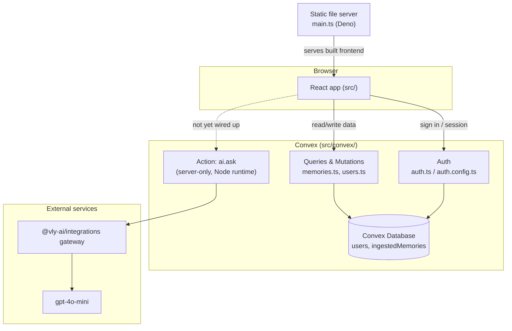
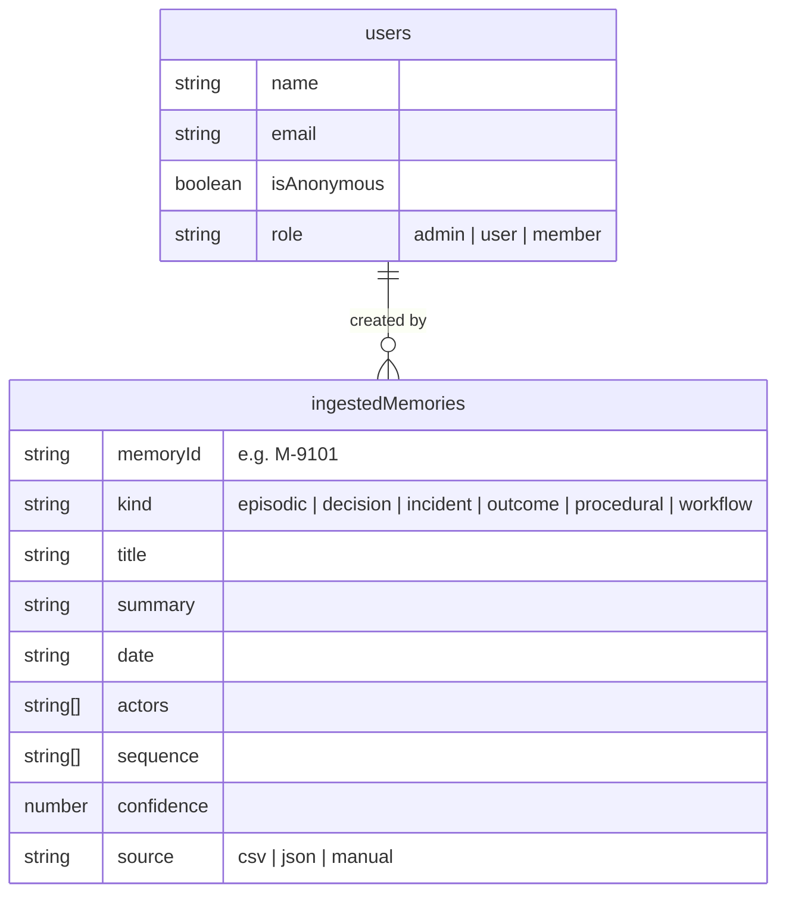

# Architecture

This document explains how ShadowOps is put together: the layers, where data
lives, how a request flows end to end, and what's real versus mocked today.

---

## 1. System overview



**Three layers:**

1. **Frontend** — a single-page React app under `src/`. Everything the user sees.
2. **Backend (Convex)** — the database, auth, and server-side functions, under
   `src/convex/`. Runs independently of the frontend and is reachable over its
   own URL (`VITE_CONVEX_URL`).
3. **Static host** — `main.ts`, a small Deno server that serves the built
   frontend (`dist/`) once deployed. It doesn't run any app logic itself.

---

## 2. Frontend architecture

```
src/
├── main.tsx        → app entry: sets up ConvexAuthProvider, router, routes
├── pages/          → one component per route (see routing table below)
├── components/
│   ├── shadowops/  → ShadowOps-specific UI (brand, visualizations, primitives)
│   ├── shadowops3d/→ the Three.js organization-twin scene
│   └── ui/         → shadcn/ui primitives (button, dialog, card, ...)
├── hooks/          → use-auth (Convex session), use-mobile (viewport)
├── lib/            → client-side data + logic (see §4 below)
├── convex/         → backend functions (see §3 below)
└── assets/         → images
```

**Routing table** (`src/main.tsx`):

| Path | Page | Protected? |
|---|---|---|
| `/` | Landing | No |
| `/auth` | Auth (sign in / sign up) | No |
| `/dashboard` | Dashboard | Yes |
| `/intelligence` | Intelligence (chat) | Yes |
| `/memory` | Memory Explorer | Yes |
| `/workflows` | Workflows | Yes |
| `/organization-3d` | Organization 3D | Yes |
| `/ingest` | Memory Ingest | Yes |
| `/system` | System Health | Yes |
| `*` | Not Found | No |

Protected routes are wrapped once, in `main.tsx`, with `<RequireAuth><AppShell /></RequireAuth>` — individual pages don't each re-implement the auth check.

State is local to each page (`useState`/`useMemo`); there's no global store. Convex's `useQuery`/`useMutation`/`useAction` hooks are the only shared state layer, and they aren't currently used outside of auth and the ingest page (see §4).

---

## 3. Backend architecture (Convex)

```
src/convex/
├── schema.ts        → database tables
├── auth.ts / auth.config.ts / auth/emailOtp.ts  → Convex Auth setup (do not modify)
├── users.ts         → currentUser query
├── memories.ts      → ingestMemories mutation, listIngested / ingestStats queries
├── ai.ts            → ask action — calls an LLM via a server-only integrations helper
└── http.ts          → HTTP routes (currently just auth's own routes)
```

### Data model



`users` comes from Convex Auth's built-in tables. `ingestedMemories` is the
one app-specific table — it's where memories uploaded through the **Memory
Ingest** page (`/ingest`) actually get stored.

### The `ai.ask` action

`src/convex/ai.ts` is a real, working Convex **action** (server-side only,
Node runtime — required because it calls an external API). It:

1. Builds a system prompt describing ShadowOps' voice and rules
2. Sends the conversation plus optional memory context to `gpt-4o-mini` through
   a billed integrations gateway
3. Returns the model's answer

**This action is not currently called from the frontend.** The `/intelligence`
chat page runs entirely on a local, hardcoded mock (see §4) — the real AI path
exists and works, but nothing in the UI invokes it yet.

---

## 4. What's real vs. mocked

This is the most important thing to understand about the current state of the
app:

| Feature | Status |
|---|---|
| Auth (sign in, sessions, roles) | **Real** — Convex Auth, backed by the database |
| Memory Ingest (`/ingest`) | **Real** — writes to the `ingestedMemories` table via `memories.ts` |
| `ai.ask` action | **Real, but unused** — works end to end, just not called by any page yet |
| Dashboard stats, patterns, discoveries | **Mock** — hardcoded in `src/lib/shadowops-data.ts` |
| Intelligence chat answers | **Mock** — `src/lib/shadowops-agent.ts` pattern-matches the question text and returns a canned answer, with a fake typing/"accessing memory" delay |
| Organization 3D what-if simulation | **Mock** — logic lives in `src/lib/shadowops-3d.ts` |
| "Hindsight" memory engine | **Narrative only** — no such service is actually integrated; see `SystemHealth.tsx` for the display-only status panel |

In short: the **shape** of the product (chat → evidence → memory) is fully
built in the UI, but it's currently a **scripted demo** for everything except
auth and the ingest form. Wiring the Intelligence page to the real `ai.ask`
action, and having `ai.ask` read from `ingestedMemories` instead of a static
prompt string, is the natural next step to make it real end to end.

---

## 5. Request lifecycle examples

**Signing in:**
```
Browser → /auth → useAuth().signIn() → Convex Auth (emailOtp.ts) → session token
        → ConvexAuthProvider stores session → protected routes unlock
```

**Asking a question today (mocked):**
```
User types question → Intelligence.tsx → askAgent(question)  [local, synchronous]
        → keyword-matched against a fixed answer set in shadowops-agent.ts
        → fake "Accessing organizational memory..." steps rendered with setTimeout
        → canned answer + evidence chips rendered
```

**Ingesting a memory (real):**
```
User uploads/fills form → MemoryIngest.tsx → useMutation(api.memories.ingestMemories)
        → Convex mutation validates + writes a row → ingestedMemories table
        → listIngested / ingestStats queries reflect the new row reactively
```

---

## 6. Deployment

```
bun run build   →  tsc -b && vite build  →  dist/
                                              │
                                              ▼
                                   main.ts (Deno, Hono)
                                   serves dist/assets/* and
                                   falls back to dist/index.html
```

The Convex backend deploys separately (`npx convex deploy`) and is addressed
by the frontend purely through `VITE_CONVEX_URL` — the two halves have
independent deploy lifecycles.
```
